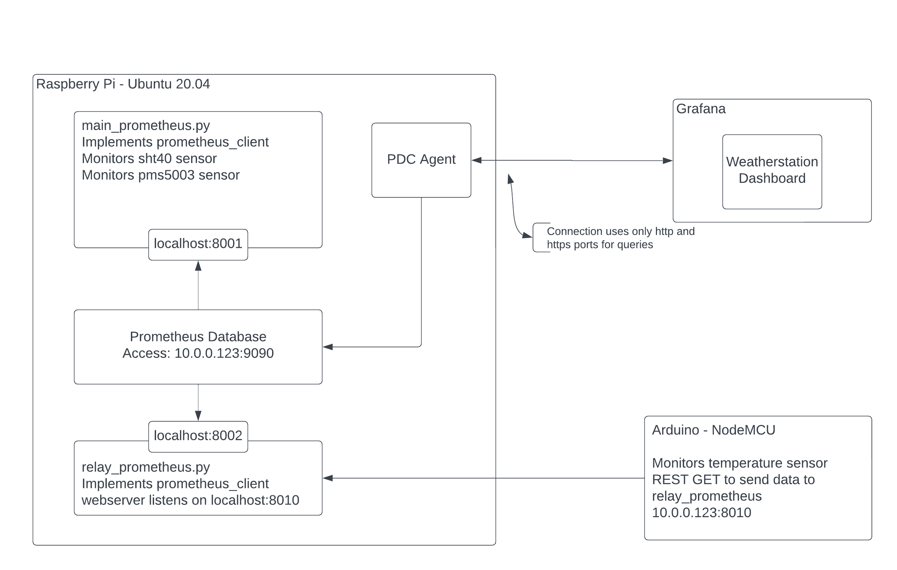

# Weather Station on the Raspberry Pi 4
## Description of System
### Hardware
Raspberry Pi 4 running Ubuntu

Two sensors are directly connected to the Pi:
1. SHT40 Temperature and Humidity
2. PMS5003 Particle Sensor

Arduino NodeMCU WiFi module with a thermistor temperature probe

### Software
There are 4 system services configured to run the various processes.
1. aqi_pi.service - Python script which initializes and monitors the two direct-attached sensors. Implements the prometheus_client which exposes the http port 8001 with metrics data.
2. pdc.service - Private Datasource Connect service which allows Grafana cloud to access the prometheus database on the Pi without exposing any ports other than 80, 443.
3. prometheus.service - Prometheus database service which stores metrics and exposes them to Grafana cloud.
4. relay_prometheus.service - REST API server to GET temperature metrics from external sensor. Implements the prometheus_client which exposes the http port 8002 with metrics data.

### Diagram

## Helpful Links
https://opensource.com/article/21/7/home-temperature-raspberry-pi-prometheus

## Diagnosing Failure
1. Check main_prometheus.py is running
2. Check prometheus_client is exporting data at localhost:8001
3. Check prometheus server is exporting data at localhost:9090
4. Check Private Datasource Connect (PDC) service is running
5. Check IP address is still the same
