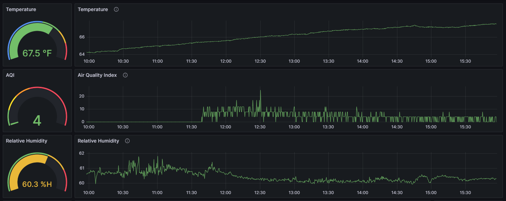

# Weather Station on the Raspberry Pi 4
## Description of System
### Hardware
Raspberry Pi 4 running Ubuntu

Two sensors are directly connected to the Pi:
1. SHT40 Temperature and Humidity
2. PMS5003 Particle Sensor

Arduino NodeMCU WiFi module with a thermistor temperature probe

### Software
There are 4 system services configured to run the various processes.
1. aqi_pi.service - Python script which initializes and monitors the two direct-attached sensors. Implements the prometheus_client which exposes the http port 8001 with metrics data.
2. pdc.service - Private Datasource Connect service which allows Grafana cloud to access the prometheus database on the Pi without exposing any ports other than 80, 443.
3. prometheus.service - Prometheus database service which stores metrics and exposes them to Grafana cloud.
4. relay_prometheus.service - REST API server to GET temperature metrics from external sensor. Implements the prometheus_client which exposes the http port 8002 with metrics data.

### Diagram

## Example Dashboard on Grafana

## Helpful Links
https://opensource.com/article/21/7/home-temperature-raspberry-pi-prometheus

## Configuring Grafana
TODO:
## Diagnosing Failure
1. Check main_prometheus.py is running and prometheus_client is exporting data at localhost:8001
2. Check relay_prometheus.py is running and prometheus_client is exporting data at localhost:8002
3. Check prometheus server is exporting data at localhost:9090
4. Check Private Datasource Connect (PDC) service is running.
Check if there is an error message about an expired certificate. Has happened twice despite creating the certificate with no expiration.*
```bash
sudo systemctl status pdc.service
```
5. Check IP address is still the same - this is in reference to the fact that Grafana PDC configuration needs an actual IP address, cannot use localhost:9090.


*-To generate a new certificate, login to Grafana. Under Optoins hamburger click Connections, click Private data source connection. Select one of the connectins. Look at the tokens. Then go to Access Policies page.